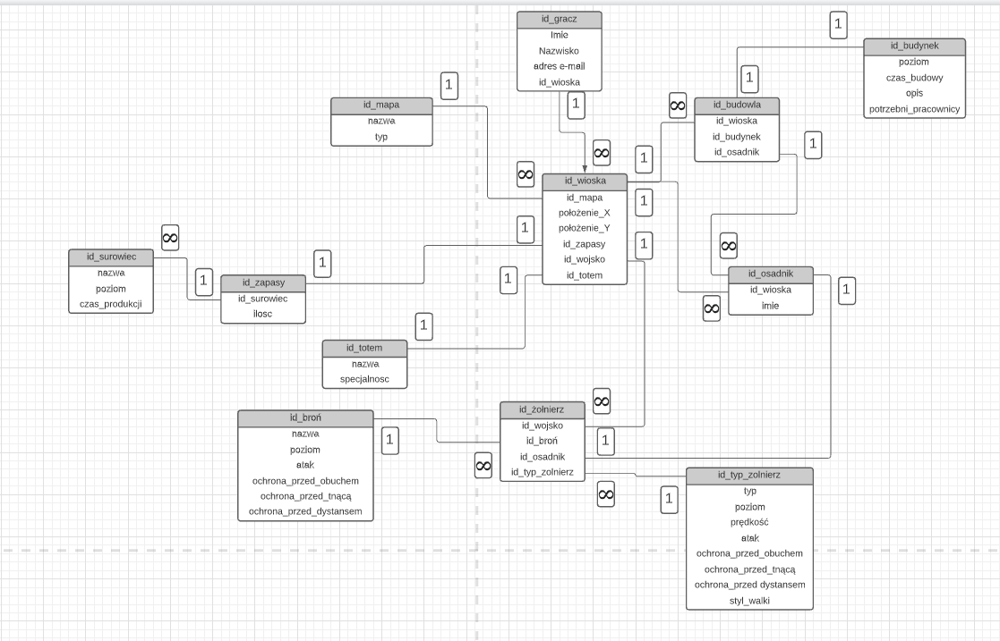

# PreGame
Nazwa projektu: PreGame

Opis: Gra strategiczna przeglądarkowa w której gracze rywalizują między sobą o jak największą ilość punktów rozwoju i punktów walki. Mogą również podbijać wioski innych graczy, albo wysyłać do nich wsparcie w postaci wojsk.
Wygląd gry opierać się będzie na interaktywnym interfejsie, widoku podglądu wojsk, budynków i ich poziomów, otworzenia menu budynku oraz otworzenia mapy świata. Gra nie będzie typową strategią komputerową, wszystko będzie trwało w większym przedziale czasowym, np. Budowa określonego budynku na wysoki poziom może potrwać nawet cały dzień, a szkolenie wojsk pół dnia.

Mapa

Mapa składać się będzie z siatki np. 100x100 na której losowo umieszczane będą wioski graczy. Wraz z rozwojem miasta gracza wioska na mapie również będzie zmieniać nieznacznie swój wygląd proporocjonalnie do ilości punktów. Na mapie pojawią się również wioski bandytów na które będzie można napadać, rabować i robić misje.
Osadnicy
Osadnik może być albo robotnikiem pracującym w którymś z budynków, albo jednostką bojową, albo Szamanem. Szaman może być tylko jeden i posiada dodatkowe moce magiczne oraz jest najsilniejszą jednostką bojową.

Budynki

Kopalnia kamienia – Im wyższy poziom budowli tym szybciej robotnicy kopią kamień
Tartak – Im wyższy poziom budowli tym szybciej robotnicy wytwarzają drewno.
Huta żelaza – Im wyższy poziom budowli tym szybciej wydobywane jest żelazo.
Ognisko - budynek startowy, gdzie po kliknięciu otwiera się menu ze wszystkimi możliwymi budowami budynków, im większy poziom ogniska tym budowle wznoszą się szybciej.
Koszary – W tym budynku można szkolić przeróżnych wojowników z dostępnych ludzi i broni.Trzeba np. Posiadać dostępną procę oraz jednego wolnego człowieka, aby wyszkolić procarza. Również można wyszkolić daną jednostkę poraz kolejny po to żeby wskoczyła na wyższy poziom wyszkolenia.
Im wyższy poziom budynku tym szybciej wykonują się zlecenia.
Zbrojownia – W tym miejscu można tworzyć odpowiednie bronie dla wojowników. W tym budynku można również ulepszać jakość wykonania broni.
Im wyższy poziom budynku tym szybciej wytwarzane są narzędzia
Chata wieszcza – W tym miejscu można wytwarzać i ulepszać totemy dające przeróżne bonusy, oraz rzucać zaklęcia na inne wioski. Walutą za jaką można takie totemy nabyć są punkty wyznania. Im wyższy poziom budynku tym szybciej punkty wyznania są generowane.
Chata szamana – W tym miejscu można rozwijać zdolności magiczno bojowe Szamana.
Mur – Rodzaj budowli podnoszącej statystyki obronne jednostek. Im wyższy poziom budowli tym większy bonus do statystyk.
Do każdego budynku można przydzielić pracownika, musi być on wolnym osadnikiem. Im więcej robotników pracuje w danej budowli tym rzeczy w niej zlecone działają szybciej.
Wojsko

Procarz – Jednostka ofensywna. 
Prędkość poruszania się jednostki – szybka
Rodzaj broni: Proca

Łucznik – Jednostka defensywna. 
Prędkość poruszania się jednostki – wolna
Rodzaj broni: Łuk

Wojownik – Jednostka uniwersalna. 
Prędkość poruszania się jednostki – wolna
Rodzaj broni: Maczuga

Nożownik – Jednostka ofensywna. 
Prędkość poruszania się jednostki - szybka
Rodzaj broni: Obsydianowy nóż

Oszczepiarz – Jednostka defensywna
Prędkość poruszania się jednostki – średnia
Rodzaj broni: Oszczep

Tarczownik – Jednostka defensywna
Prędkość poruszania się jednostki – wolna
Rodzaj broni: Tarcza

Bronie
Proca – Broń dystansowa
Łuk – Broń dystansowa
Maczuga – Broń obuchowa
Nóż – Broń tnąca
Oszczep – Broń tnąca
Tarcza – Broń obuchowa

System statystyk

Opis: Każda broń oraz jednostka posiadają poziom wykonania oraz poziom wyszkolenia. W zależności od tego każde połączenie broni oraz jednostki daje określone statystyki ofensywne i defensywne np.
Procarz (poziom 3) z procą (poziom 5)
Atak bronią dystansową – 40
Obrona przed bronią dystansową – 7
Obrona przed bronią obuchową – 10
Obrona przed bronią tnącą – 5
Tarczownik (poziom 5) z tarczą (poziom 1)
Atak tarczą – 10
Obrona przed bronią dystansową – 50
Obrona przed bronią obuchową – 45
Obrona przed bronią tnącą - 31

System walki
Gra będzie umożliwiać wysyłanie wojsk na inną osadę. System walki jest jeszcze do opracowania.

Totemy (statystyki początkowe)
Czerwony totem walki – Jednostki ofensywne są 10% silniejsze w walce.
Niebieski totem walki – Jednostki defensywne są 10% silniejsze w walce.
Totem równowagi – Wszystkie jednostki otrzymują 5% więcej statystyk defensywnych i ofensywnych.
Totem natchnienia – Wszystkie budynki pracują 5% szybciej.
Totem wiedzy – Szaman uczy się zaklęć 10% szybciej.
Totem spustoszenia – Siła ataków zaklęć niszczycielskich Szamana jest 15% mocniejsza.
Totem kamienia łupanego – Szybkość budowania wzrasta o 10%.
Totem uzdrowienia – Zaklęcia leczące Szamana są silniejsze o 15%.
Totem z sokolim okiem – Celność łuczników i procarzy wzrasta dzięki czemu są oni 15% silniejsi w walce.
Totem boski – Szybkość nabywanych punktów wyznania wzrasta o 10%.

Zaklęcia Szamana
- Zaklęcie uzdrawiające 
- Runa ogniowa
- Mrożący sopel lodu
- Wskrzerzenie zmarłego

System podboju

Do opracowania, na początek wystarczy pokonać wszystkie wojska które są w osadzie, żeby przejąć wioskę.

Zaklęcia z chaty wieszcza
Zaklęcie zniszczenia – Obniża losowy budynek we wskazanej osadzie o jeden.
Zaklęcie dobrobytu – Wioska produkuje 50% więcej surowców przez godzinę.
Zaklęcie wytrwałości – Wojska defensywne we wskazanej wiosce stają się o 50% silniejsze na godzinę.

